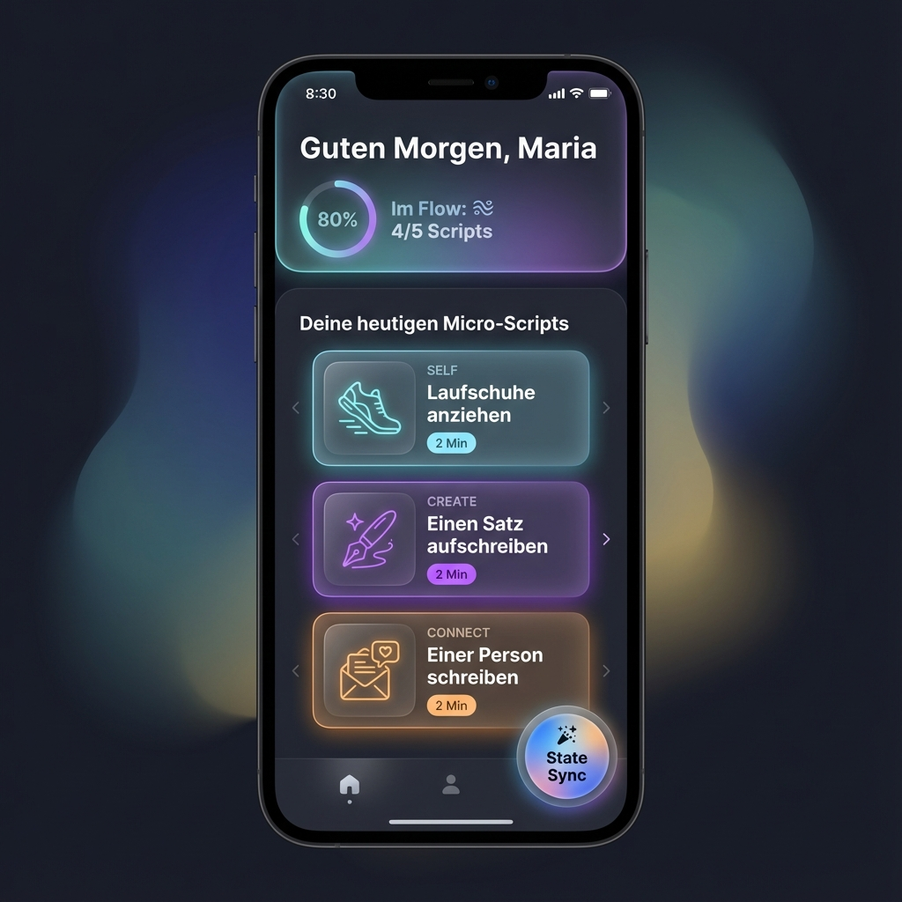
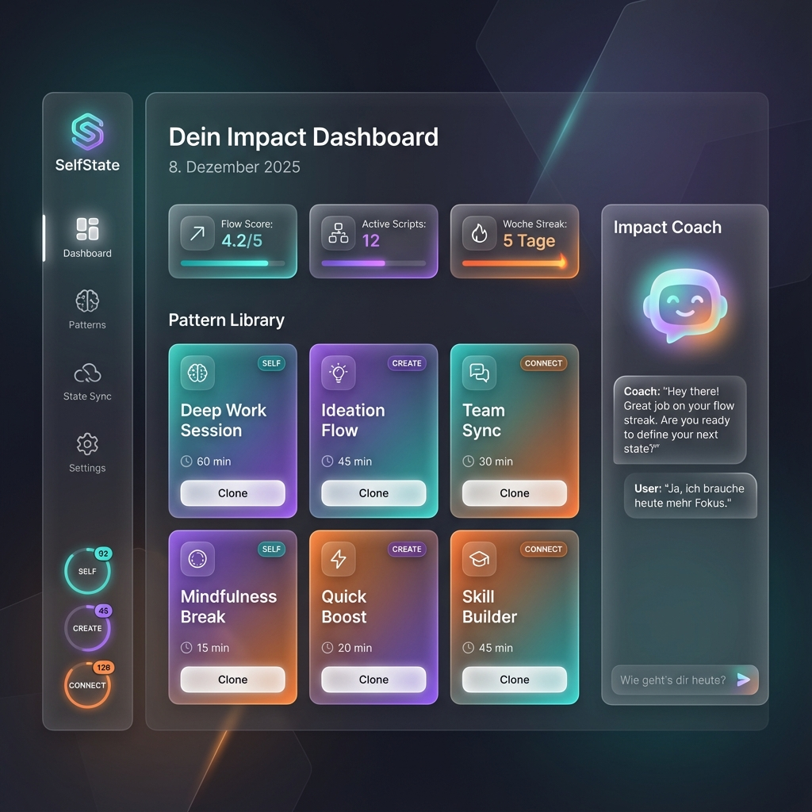
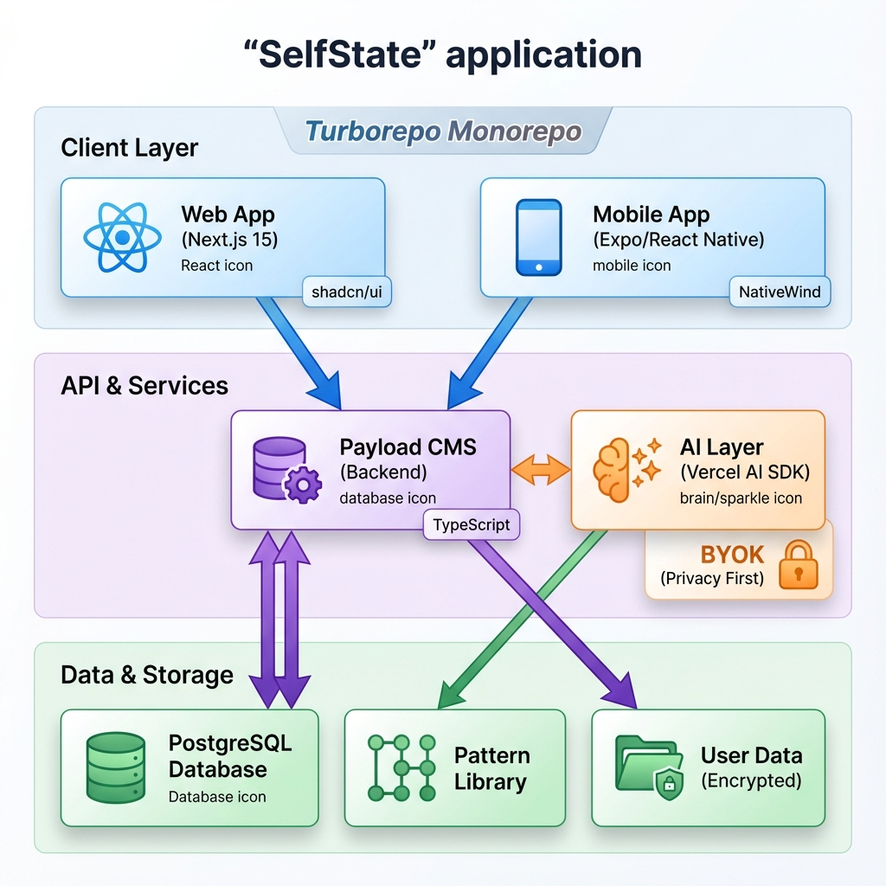
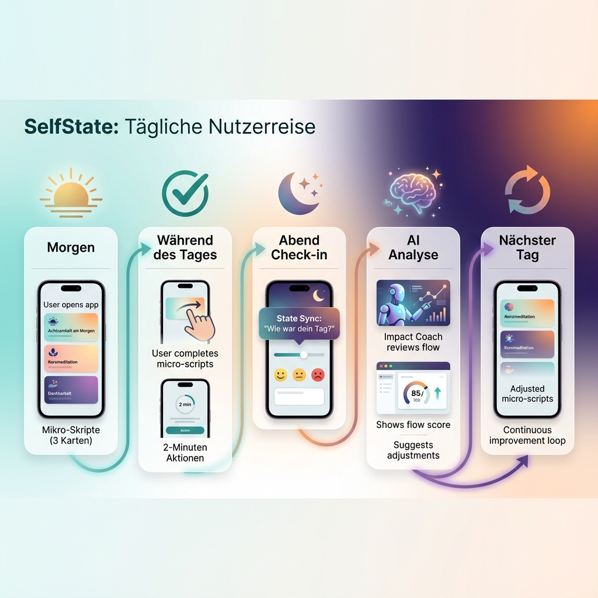

# SelfState – Visuelle Übersicht

Basierend auf dem aktuellen Planungsstand zeigen diese Visualisierungen, wie SelfState aussehen wird.

---

## 📱 Mobile App Interface

Die Haupt-Interaktionsfläche für den täglichen Gebrauch.

**Key Features:**
- **Personalisierte Begrüßung** mit Flow-Indikator
- **Card-basierte Micro-Scripts** – jede Identität (SELF/CREATE/CONNECT) hat ihre eigene Farbe
- **Swipe-Interface** – rechts für "erledigt", links für "Hürde"
- **State Sync Button** – direkter Zugang zum Impact Coach
- **Dark Mode** mit Glassmorphism-Effekten

---

## 💻 Web Dashboard

Die Desktop-Ansicht für tiefere Planung und Pattern-Browsing.

**Key Features:**
- **Impact Dashboard** mit Flow Score, aktiven Scripts und Streak-Anzeige
- **Pattern Library** – durchsuchbare Community-Patterns mit Clone-Funktion
- **Impact Coach Chat** – integrierter AI-Assistent (rechte Sidebar)
- **Identitäts-Navigation** – schneller Wechsel zwischen SELF/CREATE/CONNECT
- **Premium Design** – keine generischen Farben, harmonische Farbpalette

---

## 🏗️ Technische Architektur

Der Tech-Stack und die Systemarchitektur.

**Technologie-Übersicht:**

### Client Layer
- **Web:** Next.js 15 + shadcn/ui + TailwindCSS
- **Mobile:** Expo (React Native) + NativeWind

### API & Services
- **Backend:** Payload CMS 3.0 (TypeScript-first)
- **AI:** Vercel AI SDK mit BYOK (Bring Your Own Key)
- **Privacy:** Keine API-Keys in der Datenbank

### Data Layer
- **Database:** PostgreSQL
- **Pattern Library:** Community-getriebene Micro-Scripts
- **Encryption:** User-Daten verschlüsselt

### Orchestrierung
- **Monorepo:** Turborepo mit pnpm

---

## 🔄 User Journey

Der tägliche Flow eines SelfState-Nutzers.

**Der tägliche Zyklus:**

1. **Morgen** – App öffnen, heutige Micro-Scripts sehen
2. **Während des Tages** – Scripts erledigen (je 2 Minuten), Swipe-Interaktion
3. **Abend Check-in** – State Sync: "Wie war dein Tag?"
4. **AI Analyse** – Impact Coach analysiert Flow, schlägt Anpassungen vor
5. **Nächster Tag** – Optimierte Scripts basierend auf Feedback

**Kern-Prinzip:** Kontinuierliche Verbesserung ohne Druck – Flow statt Streaks.

---

## 📊 Aktueller Entwicklungsstand

### ✅ Fertig (Konzept & Dokumentation)
- Vision & Problemraum definiert
- Identitäten-System ausgearbeitet
- Pattern Library Taxonomie erstellt
- Tech-Stack festgelegt
- Datenmodell spezifiziert

### 🚧 In Planung (Phase 1-4)
- **Phase 1:** Payload Setup + PostgreSQL (Fundament)
- **Phase 2:** Web-Interface (Dashboard & Script Builder)
- **Phase 3:** Mobile App (Swipe-Interface & State Sync)
- **Phase 4:** AI-Integration (Impact Coach & Pattern Library)

### 🎯 Ziel
Launch am **30. September 2025** beim Social Impact Camp

---

## 🎨 Design-Prinzipien

Die Visualisierungen zeigen bereits die Kern-Designprinzipien:

1. **Premium Aesthetic** – keine generischen Farben, harmonische Paletten
2. **Glassmorphism** – moderne, transparente UI-Elemente
3. **Identitäts-Farben:**
   - SELF: Teal/Türkis (Ruhe, Selbstfürsorge)
   - CREATE: Lila/Purple (Kreativität, Innovation)
   - CONNECT: Orange/Warm (Verbindung, Community)
4. **Micro-Interactions** – subtile Animationen für besseres UX
5. **Dark Mode First** – reduziert Ablenkung, fördert Fokus

---

## 💡 Nächste Schritte

Um von der Visualisierung zur Implementierung zu kommen:

1. **Repository Setup** – Turborepo mit pnpm initialisieren
2. **Payload CMS** – Collections anlegen (users, micro_scripts, pattern_library)
3. **UI Components** – shadcn/ui Komponenten anpassen
4. **Mobile Prototype** – Swipe-Interface in Expo bauen
5. **AI Integration** – Vercel AI SDK mit BYOK implementieren

---

> **Hinweis:** Diese Visualisierungen basieren auf dem aktuellen Plan ([Plan.md](file:///Users/meikelkreuchauf/Antigravity/selfstate/selfstate/docs/Plan.md)). Sie zeigen die **Ziel-Vision**, nicht den aktuellen Code-Stand (da die Implementierung noch nicht begonnen hat).
